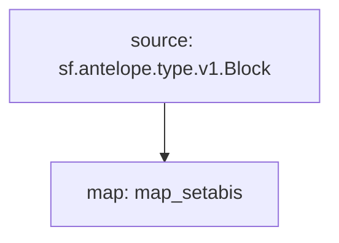

# Antelope `accounts` Substream

> Antelope newly created accounts

### [Latest Releases](https://github.com/pinax-network/substreams/releases)

### Sinks
- [Prometheus](https://github.com/pinax-network/substreams-sink-prometheus.rs)
- [KV](https://github.com/streamingfast/substreams-sink-kv)

### Quickstart

```bash
$ make
$ make run
$ make sink
```

### Graph



### Modules

```yaml
Package name: setabi
Version: v0.3.3
Doc: Ultra newly created setabi
Modules:
----
Name: map_setabis
Initial block: 0
Kind: map
Output Type: proto:antelope.setabi.v1.SetABIEvents
Hash: to be added
```